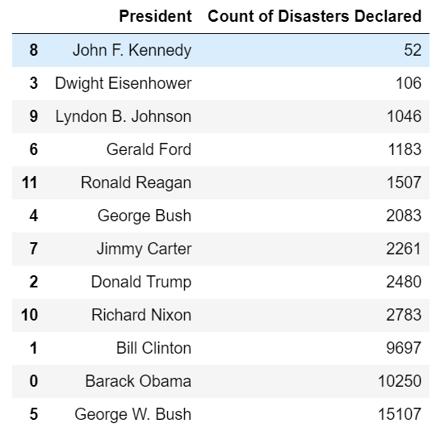
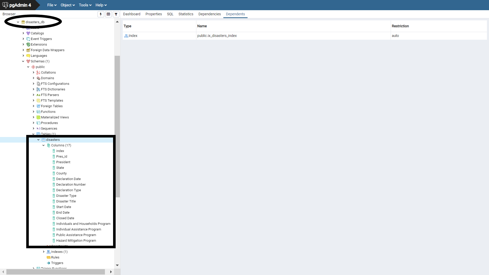

## Submitted by: Monica Zulueta-Linsangan

# ETL Project (Homework)- TOPIC

## Content
This dataset includes a record for every federal emergencies or disasters declared by the President of the United States from 1953 to present year.

## Why this topic?
* __QUESTION__: From 1953, which United States President declared the highest number of Federal Emergencies and Disasters? 
* __ANSWER__: George W. Bush

## Prerequisites
* Jupyter Notebook (pandas)
* Psycopg2
* Sqlalchemy
* sqlalchemy.ext.declarative
* sqlalchemy_utils

## EXTRACTION (Data Sources)
Extract CSVs into DataFrames:
* FEMA - `https://www.fema.gov/media-library/assets/documents/28318`(DisasterDeclarationsSummaries.csv)
* LIBRARY OF CONGRESS - `https://www.loc.gov/rr/print/list/057_chron.html`(Presidents.csv)

### (Please see file Disasters_declared.ipynb)

## TRANSFORMATION: (Data Cleanup & Analysis)
* Merged dataframes then sort by Pres_Id
* Sorted data by Declaration Number
* Summarized Data using value_counts to show count of disasters declared by each President
* Rearranged columns in meaningful order
* Renamed the column headers

### (Please see file Disasters_declared.ipynb)

## LOAD:
* Created Database Connection to PostgreSQL
* Loaded data to PostgreSQL Database (relational)
* database created in PostgreSQL as __"disasters_db"__

### (Please see file Disasters_declared.ipynb)

